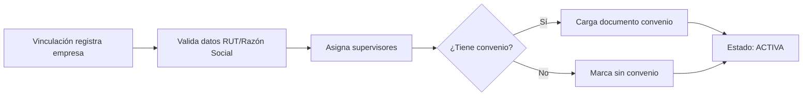
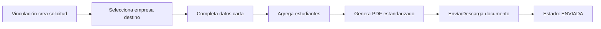
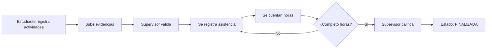
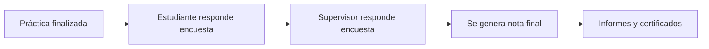

# 🏢 Sistema Multi-Empresa de Gestión de Prácticas Profesionales

## 📋 Descripción General

Sistema integral para la gestión de prácticas profesionales/pasantías orientado a múltiples empresas. Permite a instituciones educativas administrar convenios, asignar prácticas, hacer seguimiento y evaluar el desempeño de estudiantes en diferentes organizaciones.

---

## 🎯 Objetivos del Sistema

1. **Centralizar** la gestión de empresas colaboradoras
2. **Estandarizar** procesos de solicitud y autorización
3. **Facilitar** la asignación de prácticas a estudiantes
4. **Monitorear** el progreso y asistencia de practicantes
5. **Evaluar** el desempeño mediante encuestas estructuradas

---

## 🏗️ Arquitectura del Sistema

### Módulos Principales

#### 1️⃣ **JEFATURA** (Supervisión General)
- Gestión de supervisores empresariales
- Administración de empresas colaboradoras
- Visualización de reportes y estadísticas

#### 2️⃣ **VINCULACIÓN** (Vinculación con el Medio)
- Creación de solicitudes de autorización
- Estandarización de documentos
- Generación de PDFs institucionales
- Seguimiento de convenios

#### 3️⃣ **PRÁCTICAS** (Gestión de Prácticas)
- Asignación de prácticas a estudiantes
- Gestión de empresas receptoras
- Gestión de supervisores
- Seguimiento de actividades y asistencia

#### 4️⃣ **AUTENTICACIÓN**
- Inicio de sesión multi-rol
- Gestión de credenciales institucionales
- Control de acceso por rol

---

## 📊 Modelo de Datos

### Entidades Principales

#### 👤 **Usuario**
Sistema de autenticación centralizado con roles:
- `ADMIN` - Administrador del sistema
- `JEFE_CARRERA` - Coordinador académico
- `SECRETARIA` - Asistente administrativo
- `ESTUDIANTE` - Estudiante practicante
- `SUPERVISOR_EMPRESA` - Supervisor en empresa
- `VINCULACION` - Encargado de vinculación

#### 🏢 **Empresa**
Entidad central del sistema multi-empresa:
```typescript
{
  rut: string (único)
  razonSocial: string
  nombreFantasia: string
  tipo: TipoEmpresa (PUBLICA, PRIVADA, ONG, EDUCATIVA, MIXTA)
  tamano: TamanoEmpresa (MICRO, PEQUENA, MEDIANA, GRANDE)
  sector: string
  estado: EstadoEmpresa
  tieneConvenio: boolean
  fechaConvenio: DateTime
  cuposPracticas: int
  supervisores: SupervisorEmpresa[]
  practicas: Practica[]
}
```

**Estados de Empresa:**
- `ACTIVA` - Empresa activa y disponible
- `INACTIVA` - Temporalmente inactiva
- `EN_REVISION` - En proceso de validación
- `CONVENIO_VIGENTE` - Con convenio activo
- `CONVENIO_VENCIDO` - Convenio expirado

#### 👨‍💼 **SupervisorEmpresa**
Tutores y supervisores en las empresas:
```typescript
{
  rut: string
  nombre: string
  email: string
  cargo: string
  rol: RolSupervisor (SUPERVISOR_DIRECTO, JEFE_AREA, GERENTE, COORDINADOR, TUTOR)
  empresaId: int
  area: string
  practicasAsignadas: Practica[]
}
```

#### 🎓 **Estudiante**
Estudiantes que realizan prácticas:
```typescript
{
  rut: string
  nombre: string
  carrera: string
  mencion: string
  semestreActual: int
  promedioGeneral: float
  practicas: Practica[]
}
```

#### 📄 **SolicitudAutorizacion**
Documentos formales de solicitud:
```typescript
{
  codigo: string (único, ej: "PHG-2025-001")
  empresaId: int
  nombreDestinatario: string
  cargoDestinatario: string
  tipoPractica: TipoPractica
  carrera: string
  fechaInicio: DateTime
  fechaTermino: DateTime
  estudiantesJson: JSON
  estado: EstadoSolicitud (BORRADOR, ENVIADA, APROBADA, RECHAZADA)
  urlDocumento: string (PDF generado)
}
```

#### 📚 **Practica**
Asignación y seguimiento de prácticas:
```typescript
{
  codigo: string (único)
  estudianteId: int
  empresaId: int
  supervisorId: int
  tipo: TipoPractica
  fechaInicio: DateTime
  fechaTermino: DateTime
  horasTotales: int
  horasCompletadas: int
  estado: EstadoPractica (PENDIENTE, EN_CURSO, FINALIZADA, RECHAZADA, CANCELADA)
  areaAsignada: string
  notaFinal: float
  actividades: ActividadPractica[]
  asistencias: AsistenciaPractica[]
}
```

**Tipos de Práctica:**
- `PRACTICA_INICIAL` - Práctica de observación
- `PRACTICA_INTERMEDIA` - Práctica de apoyo
- `PRACTICA_PROFESIONAL` - Práctica profesional final
- `PASANTIA` - Pasantía
- `SERVICIO_COMUNITARIO` - Servicio comunitario

#### ✅ **ActividadPractica**
Actividades y tareas realizadas:
```typescript
{
  practicaId: int
  titulo: string
  descripcion: string
  fechaRealizacion: DateTime
  horasAsignadas: int
  urlEvidencia: string
  completada: boolean
  validadaSupervisor: boolean
}
```

#### 📅 **AsistenciaPractica**
Control de asistencia:
```typescript
{
  practicaId: int
  fecha: DateTime
  horaEntrada: DateTime
  horaSalida: DateTime
  horasTrabajadas: float
  presente: boolean
  justificada: boolean
}
```

#### 📝 **Sistema de Encuestas**
Evaluación estructurada con preguntas, alternativas y respuestas:
- **Pregunta** - Preguntas genéricas categorizadas
- **Alternativa** - Opciones de respuesta con puntaje
- **EncuestaEstudiante** - Evaluación del estudiante sobre la empresa
- **EncuestaSupervisor** - Evaluación del supervisor sobre el estudiante
- **RespuestaEstudiante** / **RespuestaSupervisor** - Respuestas registradas

---

## 🔄 Flujos de Trabajo

### 1. Registro de Empresa


### 2. Creación de Solicitud de Autorización


### 3. Asignación de Práctica


### 4. Seguimiento de Práctica


### 5. Evaluación Final


---

## 🔐 Roles y Permisos

| Rol | Permisos |
|-----|----------|
| **ADMIN** | Acceso total, gestión de usuarios, configuración |
| **JEFE_CARRERA** | Ver prácticas, asignar prácticas, ver reportes, gestionar estudiantes |
| **SECRETARIA** | Registrar empresas, crear solicitudes, gestionar documentos |
| **VINCULACION** | Gestionar empresas, convenios, solicitudes de autorización |
| **ESTUDIANTE** | Ver sus prácticas, registrar actividades, responder encuestas |
| **SUPERVISOR_EMPRESA** | Ver practicantes asignados, validar actividades, evaluar |

---

## 📈 Funcionalidades por Release

### **Release 1** - Jefatura & Vinculación Core
- ✅ Supervisión general
- ✅ Creación de solicitudes de autorización
- ✅ Estandarización de documentos PDF
- ✅ Ver información de prácticas

### **Release 2** - Gestión de Prácticas
- ✅ Asignación de prácticas a estudiantes
- ✅ Gestión completa de empresas
- ✅ Gestión de supervisores empresariales
- ✅ Ver detalles de prácticas
- ✅ Registro de encuestas
- ✅ Ver información de estudiantes

### **Release 3** - Autenticación & Seguridad
- ✅ Inicio de sesión con credenciales institucionales
- ✅ Gestión de contraseñas
- ✅ Recuperación de contraseña
- ✅ Cierre de sesión seguro

---

## 🔧 Configuración Técnica

### Variables de Entorno (.env)
```env
DATABASE_URL="mysql://root:@localhost:3306/gestion_practicas_empresas"
PORT=3000
JWT_SECRET="your-secret-key"
JWT_EXPIRATION="24h"
```

### Comandos Prisma
```bash
# Generar cliente
npm run prisma:generate

# Aplicar cambios al schema
npx prisma db push

# Resetear base de datos (CUIDADO)
npx prisma migrate reset

# Abrir Prisma Studio
npx prisma studio
```

---

## 📦 Estructura de Módulos Backend

```
src/
├── auth/                    # Autenticación y autorización
├── usuarios/                # Gestión de usuarios
├── empresas/                # CRUD de empresas
├── supervisores/            # CRUD de supervisores empresariales
├── estudiantes/             # CRUD de estudiantes
├── solicitudes/             # Solicitudes de autorización
├── practicas/               # Gestión de prácticas
├── actividades/             # Actividades de prácticas
├── asistencias/             # Control de asistencia
├── encuestas/               # Sistema de encuestas
└── reportes/                # Generación de reportes
```

---

## 📊 Reportes y Estadísticas

### Reportes Disponibles
1. **Empresas por sector** - Distribución de empresas por sector económico
2. **Prácticas por estado** - Estado actual de todas las prácticas
3. **Estudiantes activos** - Estudiantes con prácticas en curso
4. **Convenios por vencer** - Empresas con convenios próximos a vencer
5. **Asistencia por estudiante** - Reporte de asistencia individual
6. **Evaluaciones promedio** - Resultados de encuestas agregados

---

## 🚀 Próximos Pasos

1. Aplicar migración de base de datos
2. Actualizar módulos del backend
3. Adaptar interfaces del frontend
4. Migrar datos existentes (si aplica)
5. Realizar pruebas de integración
6. Capacitar usuarios finales

---

## 📞 Soporte

Para consultas sobre el sistema:
- **Email**: soporte@institucion.cl
- **Documentación**: `/docs`
- **API**: `/api/docs` (Swagger)

---

**Última actualización**: 27 de Noviembre de 2025
**Versión del sistema**: 2.0.0 (Multi-Empresa)
